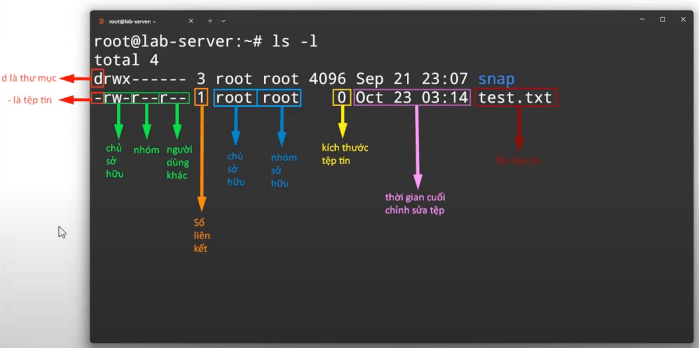

# Linux

## Linux là gì?

Linux là một hệ điều hành.

## Tại sao sử dụng linux?

- Tối ưu hiệu suất và chi phí: Linux phù hợp hầu hết phần cứng từ máy tính cá nhân đến server.
- Bảo mật và ổn định: Linux là mã nguồn mở, nhanh chóng khắc phục lỗi từ cộng đồng. Có tính ổn định
cao vì vòng đời của linux lên đến hàng chục năm.
- Khả năng kiểm soát và linh hoạt: Linux là mã nguồn mở nên mình sẽ có toàn quyền sử dụng hệ thống.
- Phát triển và cập nhập: Linux có cộng đồng sử dụng lớn nên phát triển rất mạnh.
- Tương thích đa nền tảng: Tương thích về phần cứng, phần mềm.
- Cộng đồng phát triển lớn: Cộng đồng có chuyên môn về công nghệ sử dụng.

## Cài đặt ubuntu server

- Cài đặt VMware Fusion.
- Theo như [tài liệu](https://knowledge.broadcom.com/external/article/303393/understanding-networking-types-in-vmware.html)
thì `NAT network adapter` mặc định được sử dụng là `vmnet8`. Để lấy gateway IP:

  ```bash
  vi /Library/Preferences/VMware Fusion/vmnet8/nat.config
  ```

- Làm theo video hướng dẫn. Lưu ý khi gặp `warning: gateway4 has be deprecated` làm theo [hướng dẫn](https://unix.stackexchange.com/questions/681220/netplan-generate-gateway4-has-been-deprecated-use-default-routes-instead).

## Các câu lệnh Linux

- Kiểm tra ram: `free -m`.
- Kiểm tra disk: `df -h /`.
- Đổi tên server `sudo hostnamectl set-hostname <host-name>`.
- Khởi động lại server: `sudo reboot`.
- Tra cứu thông tin network: `netstat -tlpun`.
- Tra cứu các processes: `ps -ef`.
- Kiểm tra kết nối internet: `ping 8.8.8.8`.
- Kiểm tra kết nối đến server khác: `telnet 192.168.1.199 80`.
- Kiểm tra đường truyền từ nguồn tới đích có bị chặn ở đâu không: `traceroute -T -p 80 192.168.1.199`.
- Chạy ngầm một process: `nohup command 2>&1 &`
- Đọc file từ dưới lên: `tail -n <number of last lines> <path-to-file> or tail -f <path-to-file>`

## Quyền truy cập trong Linux

Một server giống như một ngôi nhà, có:

- Chủ sở hữu.
- Nhóm sở hữu: người nhà.
- Nhóm khác: hàng xóm.
- Quyền truy cập hay Quyền tác động: chủ sở hữu có thể truy cập vào phòng cập, còn hàng xóm chỉ có
thể truy cập vào phòng khách, ...

### Người dùng và nhóm

**Các lệnh dưới đây cần thực hiện với quyền `sudo`**

Tạo user mới

- Chỉ tạo mỗi user:

  ```bash
  useradd <user-name>
  ```

- Tạo user với thông tin liên quan: home directory, group tương ứng với `<user-name>` password, full name, etc

  ```bash
  adduser <user-name>
  ```

Switch user:

```bash
su <user-name>
```

Kiểm tra thông tin user:

```bash
vi /etc/passwd
```

Xoá user

```bash
deluser <user-name>
```

Tạo một group mới:

```bash
groupadd <group-name>
```

Xoá một group:

```bash
delgroup <group-name>
```

Thêm một user vào trong group:

```bash
usermod -aG <group-name> <user-name>
```

- `-a`: append

- `-G`: Liệt kê danh sách các group của `<user-name>`. Nếu không sử dụng option này, `user` sẽ được
thêm vào group `<group-name>`, nhưng xoá bỏ khỏi tất cả các group khác.

Liệt kê các groups của một user:

```bash
groups <user-name>
```

Xoá user khỏi group:

```bash
deluser <user-name> <group-name>
```

### Quyền sở hữu

Thay đổi quyền sở hữu một file hay thư mục:

```bash
chown <user-name>:<group-name> <filename>
# or
chown -R <user-name>:<group-name> <dir-name>
```

- `<user-name>`: Chủ sở hữu
- `<group-name>`: Nhóm sở hữu

### Quyền truy cập

Có 3 quyền truy cập chính:

- Read `r`.
- Write `w`.
- Execute `x`.

Quyền truy cập

- Đối với `folder`:
  - `r`: chỉ cho phép sử dụng lệnh `ls` để xem tên các đối tượng có trong folder, nếu muốn xem thêm
  các thông tin như: kích thước, quyền hạn truy cập, chủ sở hữu, ngày khởi tạo… thì cần cấp thêm cho folder quyền `x`.
  - `w`: cho phép tạo và xóa các đối tượng trong folder.
  - `x`: chỉ cho phép chuyển vào folder khi sử dụng lệnh `cd`.
- Đối với `file`:
  - `r`: cho phép xem nội dung của file.
  - `w`: cho phép chỉnh sửa nội dung, xóa file.
  - `x`: cho phép chạy file.

Cách đọc quyền sở hữu:


- `drwxr-xr-x`:
  - `d` ở đầu: cho biết đây là thư mục
  - 3 ký tự tiêp theo `rwx`: Cho biết quyền tác động của chủ sở hữu. Ở đây, chủ sở hữu full quyền.
  - 3 ký tự tiếp theo `r-x`: Cho biết quyền tác động của nhóm sở hữu. Ở đây, nhóm sở hữu chỉ có quyền đọc và thực thi.
  - 3 ký tự tiếp theo `r-x`: Cho biết quyền tác động những user khác (user không phải chủ sở hữu cũng không nằm trong nhóm sở hữu).
- `-rw-r--r--`:
  - `-` ở đầu: cho biết đây là file
  - 3 ký tự tiếp theo `rw-`: Chủ sở hữu có quyền đọc, ghi.
  - 3 ký tự tiếp theo `r--`: Nhóm sở hữu chỉ có quyền đọc.
  - 3 ký tự tiếp theo `r--`: User khác chỉ có thể đọc.

Thay đổi quyền truy cập

```bash
chmod u=rwx,g=rx,o=- <filename or dir-name>
# or
chmod 750
# r=4, w=2, x=1
# Full quyền: r+w+x= 4 + 2 + 1 = 7
# Quyền đọc và thực thi: r+x = 4 + 1 = 5
# Không có quyền gì: 0
```

- `u`: đại diện cho `user`. Ở đây cấp cho `owner` full quyền.
- `g`: đại diện cho `group`. Ở đây nhóm sở hữu có quyền đọc và thực thi.
- `o`: đại diện cho `other users`. Ở đây những người dùng khác không có quyền gì hết.

## Tư duy triển khai mọi dự án

Điều mà một devops cần biết là: triển khai được nhiều loại dự án. Triển khai được càng nhiều loại dự án thì càng giá trị.

### Cách triển khai dự án

Công cụ

- Dự án nào cũng sẽ có công cụ tương ứng. Ví dụ: dự án về nextjs thì cài nodejs, java thì cài java, ...
- Phiên bản của công cụ phải lớn hơn hoặc bằng với yêu cầu của dự án.

File cấu hình

- Trong dự án nào cũng sẽ có các loại file:

  - File chức năng: chưa cần quan tâm.

  - File cấu hình: cần quan tâm

  - File khác: chưa cần quan tâm. Ví dụ: README để mô tả hệ thống.

Build và Run

- Ví dụ đối với dự án nextjs: cần chạy yarn build để build ra thư mục.
- Chạy thư mục đã được build ra.

**Chú ý**: Mỗi dự án sẽ có **_thư mục làm việc riêng_** với quyền tác động giới hạn. Nên cần có
**_user riêng cho dự án_** chỉ có quyền tác động vào đúng dự án cần làm việc. Không thể dùng
`root user` để chạy dự án vì phát sinh vấn đề bảo mật, hacker có thể dùng `root user` và chiếm quyền tất cả các dự án.

## Triển khai dự án Frontend

1. Tạo thư mục riêng cho dự án.
2. Tạo `user` riêng cho dự án.
3. Thay đổi chủ sở hữu và nhóm sở hữu với `chown -R`.
4. Thiết lập quyền truy cập với `chmod -R 750`.
5. Cài đặt các công cụ. (Đọc document để instal các công cụ).
6. Xem và sửa các file config: `package.json`, `vue.config.js`, `.env`.
7. Tiến hành `build`.
8. Run.
9. Kiểm tra hoạt động.

**Chú ý**: Dùng google hoặc chatgpt để đọc document về cách triển khai dự án. Đọc về các công cụ cần
thiết (java, node, ...), cách install các dependencies, cách build cũng như cách run.

**Chú ý**: Có 3 cách thông dụng để chạy một front-end. Đó là: Webserver, Service, PM2.

### Run frontend bằng NGINX webserver

Cách thường sử dụng nhất cho các dự án frontend

1. Cài đặt `nginx` với `apt install`.
2. Nginx mặc định chạy ở port 80. Kiểm tra với `netstat -tlpun`.
3. Tạo file config `.conf` cho dự án ở trong thư mục `/etc/nginx/conf.d/`

   ```nginx
   server {
       listen 8081;
       root /projects/todolist/dist/;
       index index.html;
       try_files $uri $uri/ /index.html;
   }
   ```

4. Kiểm tra syntax và khởi động lại

   ```bash
   nginx -t

   systemctl restart nginx
   # or
   nginx -s reload # Sẽ không ảnh hưởng đến các dự án khác cũng đang sử dụng nginx
   ```

5. Thêm nginx user vào trong nhóm sở hữu.

- Mỗi công cụ đều sẽ có `user` của nó. Kiểm tra thông tin `user` của nginx:

  ```bash
  vi /etc/ngin/nginx.conf
  # ở trường user.
  ```

- Thêm `nginx user` vào trong nhóm sở hữu:

  ```bash
  usermode -aG todolist www-data
  ```

- Tiến hành restart lại nginx. Nếu không thực hiện bước này. `www-data` user của nginx không thể
access vào thư mục của project. Nên chạy sẽ bị lỗi.

### Run frontend bằng service

1. Tạo file `.service` trong `/lib/systemd/system/`

   ```ini
   [Service]
   Type=simple
   User=vision
   Restart=on-failure
   WorkingDirectory=/projects/vision/
   ExecStart=npm run start -- --port=3000
   ```

2. Start service

   ```bash
   systemctl daemon-reload
   systemctl start vision
   ```

## Triển khai dự án Java spring boot

1. Tạo thư mục riêng cho dự án.
2. Tạo `user` riêng cho dự án.
3. Thay đổi chủ sở hữu và nhóm sở hữu với `chown -R`.
4. Thiết lập quyền truy cập với `chmod -R 750`.
5. Cài đặt các công cụ cần thiết. (Đọc document để instal các công cụ).
6. Xem và sửa các file config: `package.json`, `vue.config.js`, `.env`.
7. cài đặt và thiết lập database.
8. Tiến hành `build`.
9. Run.
10. Kiểm tra hoạt động.

**Chú ý**: Dùng google hoặc chatgpt để đọc document về cách triển khai dự án. Đọc về các công cụ cần
thiết (java, node, ...), cách install các dependencies, cách build cũng như cách run.

**Chú ý**: Khi build hay run project cần phải sử dụng đúng account. Không sử dụng account `root`.

### Cài đặt và cấu hình database

1. Cài đặt database bằng `apt`
2. Cấu hình database và restart service với `systemctl`.
   **Chú ý**: File cấu hình thường nằm trong thư mục `/etc/`

   - Ví dụ cấu hình mariadb từ `127.0.0.1:3306` thành `0.0.0.0:3306`. Cho access từ anywhere thay vì chỉ trong localhost.

3. Truy cập vào database để thao tác với database:

   ```bash
   mysql -u root
   ```

4. Tạo database riêng cho dự án:

   ```sql
   -- Liệt kê danh sách các databases
   show databases;

   -- Tạo database
   create database <db-name>;
   ```

5. Tạo user riêng cho dự án án:

   ```sql
   create user '<user-name>'@'%' indentified by '<password>';
   -- The @'%' part specifies where the user is allowed to connect from>
   -- The % symbol is a wildcard that means the user can connect from any host
   ```

6. Gán quyền cho user thao tác trên database

   ```sql
   grant all privileges on shoeshop.* to 'shoeshop'@'%';
   -- ALL PRIVILEGES means the user gets all available permissions (like SELECT, INSERT, UPDATE, DELETE, CREATE, DROP, etc.).
   -- shoeshop.*: This means all tables within the shoeshop database. So, the user is being granted privileges on every table in that database.

   flush privileges;
   -- Reload the privileges from the grant tables in the database
   ```

7. Kiểm tra

   ```bash
   mysql -h <ip> -P <port> -u <user-name> -p
   # Thử login vào trong mysql với user vừa tạo
   ```

   ```sql
   show database;
   -- Kiểm tra coi có database mình vừa cấp quyền không
   ```

8. Import data vào trong database

   ```sql
   use <db-name>;
   -- sử dụng db

   source <path-to-sql-file>;
   -- import data

   show tables
   -- kiểm tra các tables được import từ data
   ```
