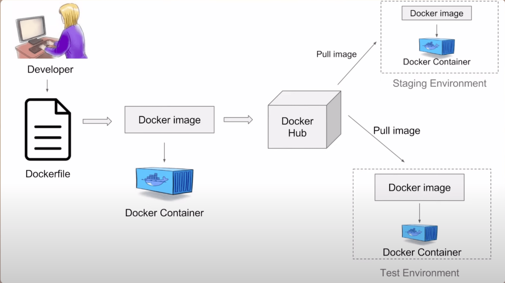

# Docker

## Tại sao cần sử dụng Docker?

Mỗi dự án khi hoạt động cần phải cài đặt các libraries/packages cần thiết như: maven, java, nodejs,
etc. Trên cùng một server, các dự án khác nhau có thể yêu cầu các version khác nhau của cùng một
libraries/packages nên dẫn đến khó khăn trong việc quản lý các libraries/packages. Ví dụ: dự án
A yêu cầu Nodejs version 11, B yêu cầu Nodejs version 18.

Việc những cập nhập về libraries/packages của dự án A sẽ có thể gây ảnh hưởng đến dự án B, do cùng
dùng chung một hạ tầng.

Trong dự án thực tế, các dự án lớn sẽ cần triển khi trên nhiều server khác nhau để hoạt động hiệu quả.
Việc thiết lập môi trường làm việc (e.g. cài đặt libraries/packages) cho dự án lớn sẽ khó khăn và
tốn nhiều thời gian. Làm thể nào để thiết lập môi trường làm việc hiệu quả cho dự án trên các server
khác nhau?

**Docker** giúp tạo ra các môi trường làm việc độc lập (tránh xung đột nhau) và môi trường đó có thể
đóng gói để đem qua sử dụng trên các server khác nhau.

## Docker là gì?

**Docker** là nền tảng áo hoá cấp `container`, giúp tạo ra các môi trường độc lập cho phép người phát
triển đóng gói ứng dụng và tất cả dependencies của ứng dụng vào một container duy nhất.

## Docker architecture



## Các sử dụng Docker

### Cài đặt docker

```bash
vi install-docker.sh
```

```bash
#!/bin/bash

sudo apt update
sudo apt install -y apt-transport-https ca-certificates curl software-properties-common
curl -fsSL https://download.docker.com/linux/ubuntu/gpg | sudo gpg --dearmor -o /usr/share/keyrings/docker-archive-keyring.gpg
echo "deb [signed-by=/usr/share/keyrings/docker-archive-keyring.gpg] https://download.docker.com/linux/ubuntu $(lsb_release -cs) stable" | sudo tee /etc/apt/sources.list.d/docker.list > /dev/null
sudo apt update
sudo apt install -y docker-ce
sudo systemctl start docker
sudo systemctl enable docker
sudo curl -L "https://github.com/docker/compose/releases/latest/download/docker-compose-$(uname -s)-$(uname -m)" -o /usr/local/bin/docker-compose
sudo chmod +x /usr/local/bin/docker-compose
docker --version
docker-compose --version
```

```bash
chmod +x install-docker.sh
bash install-docker.s
```

### Sử dụng docker

```bash
# Pull a docker image
docker pull <image-name>:<tag>
# List all available images
docker images
# Run a docker image with interactive bash
docker run --name <container-name> -it <image-name>:<tag>
# List all running containers
docker ps
# List all available containers
docker ps -a
# Start a container
docker start <container-name>
docker start <container-id>
# Access to an running container
docker exec -it <container-name> /bin/bash
# Stop a container
docker stop <container-name>
# Remove a  container
# The container must be stopped before being removed
docker rm <container-name>
# Remove all containers
docker rm -f $(docker ps -a)
# Remove docker images
# The container using this image must be removed before being removed
docker rmi <image-name>:<tag>
```

**Chú ý**: Các image sẽ được tối giản hết mức có thể để triển khai dễ dàng và nhanh chóng, nên đôi
khi sẽ thiếu một số packages, nhưng mình hoàn toàn có thể cài đặt các packages đó bằng cách dùng `Dockerfile`.

## **Tư duy** Dockerize các dự án

### Dockerfile để làm gì?

`Dockerfile` là file cấu hình, để:

- Đưa source code vào container.
- Cài đặt các công cụ để chạy dự án.

### Dockerfile Commands

### Tư duy viết Dockerfile tối ưu

- non `root user`: chạy ứng dụng bằng `user` phù hợp, không triển khai dự án bằng `user root`.
- `base image`:
  - Chọn `base image` phù hợp, tránh những công cụ được cài đặt không cần thiết, giúp tối ưu dung
    lượng `docker image`.
  - Đề xuất nên sử dụng các `docker image` được build on top của `alphine` vì nó rất nhẹ và tối ưu.
  - Chọn nhưng `docker image` uy tín như: official, verified, sponsored.
  - Sử dụng công cụ quét `docker image` để kiểm tra những lỗ hổng, và đánh giá xem có thể chấp nhận
  được những lỗ hỗng này hay không?
- `multi-stage`: giảm kích thước `docker image` cuối cùng.

## Dockerfile cho dự án backend

```Dockerfile
# Stage 1: Build Stage
# Use the official Maven image with JDK 8 on Alpine Linux as the base image to build the application.
# The 'as build' alias allows referencing this stage in later instructions.
FROM maven:3.5.3-jdk-8-alpine as build

# Set the working directory to /app inside the container.
# All subsequent commands will execute from this directory.
WORKDIR /app

# Copy all files from the current host directory to /app in the container.
# This includes the pom.xml and source code needed for the Maven build.
COPY . .

# Run Maven to install dependencies and package the application into a JAR file.
# The -DskipTests=true flag skips unit tests to speed up the build process.
RUN mvn install -DskipTests=true

# Stage 2: Run Stage
# Use the official Alpine Linux 3.19 image as the base for a lightweight runtime environment.
FROM alpine:3.19

# Create a non-root user 'shoeshop' with default settings (-D disables password).
# Running as non-root enhances container security.
RUN adduser -D shoeshop

# Install OpenJDK 8 JRE from Alpine's package manager.
# This provides the Java runtime needed to execute the JAR file.
RUN apk add openjdk8

# Set the working directory to /run in the container.
# This is where the application will reside and execute.
WORKDIR /run

# Copy the compiled JAR file from the 'build' stage's /app/target directory.
# The --from=build flag references the previous stage's filesystem.
COPY --from=build /app/target/shoe-ShoppingCart-0.0.1-SNAPSHOT.jar .

# Change ownership of the /run directory and its contents to the 'shoeshop' user.
# This ensures the non-root user has the necessary permissions.
RUN chown -R shoeshop:shoeshop /run

# Switch to the 'shoeshop' user for all subsequent instructions and runtime.
# Avoids running the application as root for security purposes.
USER shoeshop

# Expose port 8080 to allow external access to the application.
# This is the default port for many Java web applications (confirm with your app).
EXPOSE 8080

# Define the command to run the JAR file when the container starts.
# ENTRYPOINT ensures this command executes directly, using the Java runtime.
ENTRYPOINT ["java", "-jar", "/run/shoe-ShoppingCart-0.0.1-SNAPSHOT.jar"]
```

Using multi-staged builds in Dockerfile offers smaller size of the final `Docker Image`, because:

- Minimize unnecessary files: In a traditional Dockerfile, the build process (like compiling, dependencies, and temporary files) is included in the final image. With multi-stage builds, you can discard all the unnecessary files from imtermediate stages and only include the artifacts in the last stage that are
required for running the application (e.g., the final JAR or binary). This leads to a much smaller
and more efficient image.

- No Build Dependencies in Final Image: For example, in your Dockerfile, the maven image is used to build the application, but only the built .jar file is transferred to the runtime image. This means the final image doesn't include unnecessary build tools, such as Maven, or the source code itself, which keeps it lightweight.

## Dockerfile cho dự án frontend

```Dockerfile
# Use Node.js version 18.18 based on lightweight Alpine Linux as the base image for the build stage
# 'as build' names this stage so we can reference it later
FROM node:18.18-alpine as build

# Set the working directory inside the container to /app
# All following commands will be executed from this directory
WORKDIR /app

# Copy all files from the current directory on the host to /app in the container
# The first '.' is the source (host), the second '.' is the destination (container)
COPY . .

# Install all dependencies listed in package.json
# This runs npm install in the /app directory
RUN npm install

# Execute the build script defined in package.json
# Typically creates an optimized production build in a 'dist' folder
RUN npm run build

## Run Stage Definition ##
# Start a new stage using nginx with Alpine Linux as the base image
# This creates a fresh image for running the application
FROM nginx:alpine

# Copy the built application files from the 'build' stage
# Takes files from /app/dist in the previous stage to nginx's default HTML directory
COPY --from=build /app/dist /usr/share/nginx/html

# Inform Docker that the container listens on port 80
# This is the default port for HTTP traffic
EXPOSE 80

# Define the command to run when the container starts
# Starts nginx in the foreground (daemon off) with global configuration
CMD ["nginx", "-g", "daemon off;"]
```

## Tham thảo các mẫu Dockerfile cho các dự án khác nhau: [tại đây](https://elroydevops.tech/mau-dockerfile-cac-du-an/)

## Triển khi registry server

3 cách để triển khai `registry server`:

- `dockerhub`: nhanh và miễn phí, nhưng doanh nghiệp trong thực tế sẽ không dùng cách này.
- `self-certified private registry`: miền phí và khá giống với thực tế doanh nghiệp vì có một môi
trường riêng biệt để lưu trữ. Tuy nhiên, trong thực tế doanh nghiệp cũng không sử dụng cách này.
- `Harbor`: Mua domain và VPS giá rẻ. Sau đó, dùng harbor để xây dựng một `private registry`.

### Dockerhub

1. Login vào `Dockerhub` dùng `docker login` và cung cấp `username` và `password`.

2. Đổi tên image theo dạng `domain/project/repo:tag` dùng `docker tag`. Ở đây, domain mặc định là
`hub.docker.com`.

3. Push `docker image` lên `docker hub` dùng `docker push <image-name>`.

### self-certified private registry

1. Cài đặt `docker` trên `server` dành cho việc `host registry`.
2. Cài đặt `openssl` package để giúp xác thực `https` dùng `apt get install openssl`.
3. Tạo `workdir`:

    ```bash
    mkdir -p /tools/registry/ && cd /tools/registry
    mkdir data certs

    ```

4. Cài đặt chứng chỉ **tự ký** `ssl` để thiết lập với `registry`:

    ```bash
    openssl req -newkey rsa:4096 -nodes -sha256 -keyout certs/domain.key -subj "/CN=192.168.1.100" -addext "subjectAltName = DNS:192.168.1.100,IP:192.168.1.100" -x509 -days 365 -out certs/domain.crt
    ```

5. Do dùng chứng chỉ **tự ký**, nên cũng phải **tự xác nhận cho docker** biết đây là địa chỉ được
`certified`. Khi đó ta mới có thể `docker login <registry url>` vào `registry` thành công.

    ```bash
    mkdir -p /etc/docker/certs.d/<registry url>/
    # E.g. mkdir -p /etc/docker/certs.d/192.168.1.100:5000/
    cp <path>/domain.crt /etc/docker/certs.d/<registry url>/ca.crt
    systemctl restart docker
    ```

    **Chú ý**: bất kỳ `server` nào muốn `login, push, pull` tới `registry` này, để phải thực hiện
    bước này ở trên `server` đó.

    Phải copy `domain.crt` được tạo ở `bước 4` trong `server` đang `host registry` qua
    `server` muốn `access to registry`.

6. `Tạo docker-compose` thiết lập một `container` cho `registry`:

    ```yaml
    version: '3'
    services:
    registry:
        image: registry:2
        restart: always
        container_name: registry-server
        ports:
        - "5000:5000"
        volumes:
        - ./data:/var/lib/registry
        - ./certs:/certs
        environment:
        REGISTRY_HTTP_TLS_CERTIFICATE: ./certs/domain.crt
        REGISTRY_HTTP_TLS_KEY: ./certs/domain.key
    ```

7. Chạy `docker-compose up -d`
8. Tiến hành sử dụng `registry` như [Dockerhub](#dockerhub) bình thường:

    - Do chưa thiết lập `authentication` cho `registry` nên `username` và `password` nhập
    gì cũng được.

    - `docker login` phải sử dụng thêm `registry url`: `docker login 192.168.1.100:5000`.

    - `domain` hiện tại là `registry url`. Ví dụ:
    `docker tag todolist:v1 192.168.1.100:5000/elroydevops/todolist:v1`

**Chú ý**: do sử dụng xác thực **tự ký**, nên mình cần phải xác thực trên từng `server`. Điều này sẽ
ít khả thi, vì nếu doanh nghiệp có cả ngàn `server` cần kết nối đến `registry` thì mình sẽ
phải xác thực từng `server` ư? Vì vậy, cho dù cách này vẫn tạo được `free private registry` nhưng
không được các doanh nghiệp trong thực tế tin dùng.

## Cài đặt harbor registry

1. Tạo VPS cho `registry`, ở đây sử dụng `aws ec2`.
2. Thiết lập `domain` cho `registry`. Ở đây dùng `cloudflare`
    - Giao diện các trình quản lý `domain` có thể khác nhau, nhưng về bản chất là giống nhau.
    - Tạo `record` mới với information:
        - Type: A
        - Name: registry (địa chỉ mà mình muốn). Ví dụ: `name=registry` thì `
        DNS=registry.elroydevops.online`.
        - IPv4 address: Public IP từ `aws ec2`.
3. Cài `docker` trên `server ec2`.
4. Cài đặt `certbot` bằng `apt install certbot -y`, công cụ giúp xác thực `domain` này đáng tin cậy.
5. Cài đặt `Harbor`:

    - Download `Harbor`:

        ```bash
        mkdir -p /tools/harbor && cd /tools/harbor

        curl -s <https://api.github.com/repos/goharbor/harbor/releases/latest> | grep browser_download_url | cut -d '"' -f 4 | grep '.tgz$' | wget -i

        tar xvzf harbor-offline-installer*.tg
        cd harbor
        cp harbor.yml.tmpl harbor.ym
        ```

    - Thiết lập `certbot`:

        ```bash
        # Domain được thiết lập ở bước 2
        export DOMAIN="<your-registry-domain>"
        # Để certbot xác thực được cần dùng thêm email
        export EMAIL="<your-email>"

        sudo certbot certonly --standalone -d $DOMAIN --preferred-challenges http --agree-tos -m $EMAIL --keep-until-expiring
        ```

        - `certonly`: Tells Certbot to obtain a certificate but not install it automatically into a web server (e.g., Apache or Nginx).
        - `standalone`: Instructs Certbot to run its own temporary web server to handle the certificate validation process.
        - `--preferred-challenges http`: Forces Certbot to use the HTTP-01 challenge for domain validation.

    - Cấu hình `harbor.yml`:

        ```yml
        hostname: <your-registry-domain>

        https:
            certificate: <path_to_certificate_generated_by_certbot>
            key: <path_to_key_generated_by_certbot>
        ```

    - Install `harbor`:

        ```bash
        ./prepare.sh
        ./install.sh
        ```

6. Tiến hành sử dụng `registry` như [Dockerhub](#dockerhub) bình thường:

    - `username` và `password` cho `root user` có thể xem ở `habor.yml`.

    - `docker login` phải sử dụng thêm `registry url`: `docker login <your-registry-domain>`.

    - `domain` hiện tại là `registry url`. Ví dụ:
    `docker tag todolist:v1 registry.elroydevops.online/elroydevops/todolist:v1`

**Chú ý**: Trong thực tế, cần sử dụng thêm kỹ thuật `whitelist ip`. Chỉ cấp phép truy cập cho các `ip`
trong `whitelist` được kết nối tới `registry domain`. Giúp tăng tính bảo mật, tránh bị người lạ tấn công.

## Sử dụng các thành phần khác của Docker

### Docker volume

Nếu không sử dụng `mount volume` thì sau khi `remove` hoặc `stop` `container` đi, mọi dữ liệu trong
`container` sẽ mất hết.

### Docker compose

`Docker compose` giúp khai báo, thiết lập và quản lý các ứng dụng chạy cùng lúc nhiều `containers`.

### Docker network

Dùng `docker inspect <container-name>` để kiểm tra thông tin `network` và các thông tin khác.

## Triển khai Gitlab CI/CD dự án Docker

1. Thêm `user: gitlab-runner` vào trong `group: docker`. Vì nếu không `CI/CD` sẽ bị `permission denied`
khi làm việc với `docker`: `usermode -aG docker gitlab-runner`.
2. Thêm `variable` trong `Settings > CI/CD > Variable`:
    - `REGISTRY_URL`
    - `REGISTRY_USER`
    - `REGISTRY_PASSWORD`
    - `REGISTRY_PROJECT`

3. Cấu hình `CI/CD`:

    ```yaml
    # Define environment variables that will be used throughout the pipeline

    variables:
        # DOCKER_IMAGE is the full path for the Docker image, including the registry URL, project, image name,
        # tag (which is derived from the commit tag), and the short commit SHA.
        # REGISTRY_URL, and REGISTRY_PROJECT are custom variables defined in the Settings > CI/CD > Variables.
        # CI_PROJECT_NAME, CI_COMMIT_TAG, and CI_COMMIT_SHORT_SHA are predefined variables.
        # This ensures that each Docker image is tagged uniquely with the version and commit info.
        DOCKER_IMAGE: ${REGISTRY_URL}/${REGISTRY_PROJECT}/${CI_PROJECT_NAME}:${CI_COMMIT_TAG}_${CI_COMMIT_SHORT_SHA}

        # DOCKER_CONTAINER defines the name of the Docker container which will be created and run during deployment.
        # It is typically the same as the project name, making it easier to identify.
        DOCKER_CONTAINER: ${CI_PROJECT_NAME}

    # Define the stages of the CI/CD pipeline

    # Stages are executed in the defined order

    stages:
        - buildandpush    # Stage 1: Build and push Docker image to the registry
        - deploy          # Stage 2: Deploy the Docker container to the target environment
        - showlog         # Stage 3: Fetch and display logs from the deployed container

    # Stage 1: Build and Push Docker Image

    buildandpush:
        # Specify the stage name
        stage: buildandpush

        # Git strategy defines how the code repository is fetched. Here, "clone" means the repository is cloned
        # from scratch on every pipeline execution (ensures a clean state).
        variables:
            GIT_STRATEGY: clone

        # `before_script` is executed before the main script in the job. Here we log in to the Docker registry
        # using the credentials provided via environment variables.
        before_script:
            - docker login ${REGISTRY_URL} -u ${REGISTRY_USER} -p ${REGISTRY_PASSWORD}

        # The `script` section contains the commands that will be executed to build and push the Docker image.
        script:
            # Build the Docker image with the tag defined earlier (DOCKER_IMAGE) and the Dockerfile located in the current directory
            - docker build -t $DOCKER_IMAGE .

            # Push the built Docker image to the Docker registry, making it available for deployment
            - docker push $DOCKER_IMAGE

        # `tags` helps identify which runner to use for this job. Here, it specifies the 'lab-server' runner tag.
        tags:
            - lab-server

        # `only` ensures that this job is only executed when a Git tag is created.
        # This is typically done to avoid running build and push on every commit, but rather only when a tag (like a release version) is pushed.
        only:
            - tags

    # Stage 2: Deploy the Docker Container

    deploy:
        # Specify the stage name
        stage: deploy

        # Git strategy defines how the code repository is fetched. "none" means no repository cloning,
        # as the code is already contained in the Docker image built in the previous stage.
        variables:
            GIT_STRATEGY: none

        # `before_script` is executed before the main script in the job. Here, we log in to the Docker registry
        # with the necessary credentials.
        before_script:
            - docker login ${REGISTRY_URL} -u ${REGISTRY_USER} -p ${REGISTRY_PASSWORD}

        # The `script` section contains the commands to deploy the Docker container to the environment.
        script:
            # Pull the Docker image from the registry (use the tag defined earlier).
            - docker pull $DOCKER_IMAGE

            # Stop and remove any existing container with the name defined in DOCKER_CONTAINER.
            # This ensures that the new container can be created without conflicts.
            - docker rm -f $DOCKER_CONTAINER

            # Run the new container from the pulled Docker image. The container is named with the value in DOCKER_CONTAINER,
            # and it is run in detached mode (`-d`), mapping port 8080 on the host to port 8080 in the container.
            - docker run --name $DOCKER_CONTAINER -dp 8080:8080 $DOCKER_IMAGE

        # `tags` specifies that the job should be executed on the 'lab-server' runner.
        tags:
            - lab-server

        # `only` ensures that this job is executed only when a Git tag is created.
        # This makes sense in a production workflow where we only want to deploy tagged releases.
        only:
            - tags

    # Stage 3: Show Logs of the Deployed Docker Container

    showlog:
        # Specify the stage name
        stage: showlog

        # Git strategy defines how the code repository is fetched. Again, "none" is used as we don't need to fetch code in this step.
        variables:
            GIT_STRATEGY: none

        # `script` section contains the commands to display logs of the deployed container.
        script:
            # Sleep for 20 seconds to ensure that the container is up and running before fetching logs.
            - sleep 20

            # Display the logs of the container to see its status and output.
            - docker logs $DOCKER_CONTAINER

        # `tags` specifies that the job should be executed on the 'lab-server' runner.
        tags:
            - lab-server

        # `only` ensures that this job is executed only when a Git tag is created, ensuring that it runs only after a deployment.
        only:
            - tags

    ```
