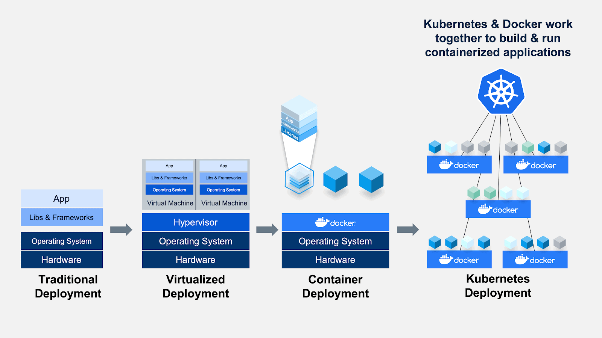

# Introduction

## Kubernetes là gì?

Kubernetes, also known as K8s, is an open source system for automating deployment, scaling, and management of containerized application.

## Các mô hình triển khai dự án

Traditional deployment:

- Chạy dự án trực tiếp trên hạ tầng của máy chủ vật lý.
- Việc xác định ranh giới và phân bổ tài nguyên cho các dự án rất phức tạp. Có thể dẫn đến việc, một
dự án chiếm hết tài nguyên của máy chủ khiến các dự án khác hoạt động kém hiệu quả hơn.
- Có thể khắc phục vấn đề trên bằng việc chạy mỗi dự án trên một máy chủ khác nhau. Tuy nhiên, sẽ khó
mở rộng được quy mô và việc tận dụng tài nguyên không hiệu quả khiến việc duy trì nhiều máy chủ sẽ khó
khăn và tốn kém.

Virtualized deployment:

- Một máy chủ vật lý có thể cài đặt được nhiều máy chủ ảo hoá khác nhau. Và triển khai dự án trên các
máy chủ ảo đó.
- Tiêu tốn tài nguyên vì mỗi máy ảo sẽ có hệ điều hành riêng. Để tạo một máy chủ ảo cho front-end thôi
thì tài nguyên dành cho hệ điều hành cũng tốn hết mấy GBs.
- Chưa linh hoạt trong việc tinh chỉnh cầu hình.

Container deployment:

- Các dự án bây giờ được đóng gói thành các môi trường riêng biệt (container) và cấp tài nguyên để
hoạt động. Nếu một dự án nào thiếu tài nguyên thì chỉ lỗi mỗi mình dự án đó thôi.
- Quá trình backup, sửa lỗi, tăng giảm tài nguyên khi traffic tăng cao, quản lý giá trị quan trọng,
... cần được thực hiện thủ công. Do vậy sẽ mất nhiều thời gian và dễ bị lỗi (error-prone) do sai sót
trong quá trình thực hiện.

## K8s để làm gì?

`k8s` giúp khắc phục và tự động hoá các vấn đề kể trên. Tự động backup, sửa lỗi, scaling, quản lý
chuyên nghiệp và tường minh hơn các giá trị.

`k8s` cần có tài nguyên và cấu hình để hoạt động.

## Khi nào nên sử dụng k8s

Khi muốn áp dụng một phương pháp, giải pháp nào đó cho doanh nghiệp cần đảm bảo 4 yếu tố:

- Hiệu quả
- Minh bạch
- Có khả năng vận hành
- Tối ưu chi phí

K8s được các công ty big-tech sử dụng rộng rãi ở trên thế giới và cả VN. Tuy nhiên, các dự án phù hợp
áp dụng k8s:

- Dự án lớn, dự án chạy đường dài
- Dự án có nhu cầu cao về mở rộng
- Dự án cần triển khai đa môi trường
- Dự án theo mô hình Microservices
- Dự án cần khả năng tự phục hồi

Không phải lúc nào cũng dùng k8s để triển khai các dự án:

- Dùng k8s để triển khai `landing page` sẽ rất lãng phí tài nguyên và thiếu nhân sự để vận hành.
- Dùng k8s cho các dự án nhỏ và ngắn hạn (các dự án outsource), trừ khi khách hàng yêu cầu còn dự án
chỉ cần code xong gửi lại cho khách hàng thì không cần thiết dùng k8s.

Để k8s hoạt động, cần bỏ một đống tiền để dựng tài nguyên cho k8s vậy có gọi là tối ưu chi phí không?

- Không đơn giản tiết kiệm chi phí về tài nguyên là tiết kiệm chi phí, cần phải xét đến nhiều yếu tố
khác như thời gian, tính tự động, tính đồng nhất, tính quy chuẩn, tính ổn định.
- Các hệ thống lớn cần tính ổn định cao một khi bị lỗi dẽ dần đến nhiều hệ luỵ như mất doanh thu,
mất khách hàng và uy tín của công ty. Nên không thể vì tiết kiệm một chút chi phí và đánh mất tính ổn
định của hệ thống.

## Hạ tầng k8s (k8s architecture)

- `Pod` represents a set of running containers in the cluster. It is the smallest working unit in k8s.
- `Node` có thể có nhiều `pod`.
- `kubelet` sẽ nhận yêu cầu từ `kube-api-server` để thực thi các `pod` trên mỗi một `node`.
- `kube-proxy` là thành phần network chạy trên mỗi `node` cho phép các `pod` giao tiếp với nhau và
giao tiếp ra bên ngoài.
- `control plane` chứa các thành phần sẽ quản lý toàn cụm k8s.
- `kube-api-server` một quy chuẩn chung để giao tiếp.
- `etcd` một cơ sở dữ liệu phân tán lưu trữ mọi cấu hình của k8s, trạng thái của tất cả các `node`, `pod`.
- `scheduler` dùng thuật toán lập lịch để phân bổ các `pod` đến các `node` dựa trên các yếu tố như tài nguyên, cpu, ram, các policy và yêu cầu cụ thể khác.
- `controller manager` quản lý các `controller`. `controller` là các tiến trình để giám sát trạng
thái của cluster và thực hiện các hành động sửa chữa nếu cần. Ví dụ, sau khi một `pod` được `scheduler`
phân phối về một `node` thì `controller manager` sẽ giám sát `pod` đó, và tạo `pod` thay thế khi `pod`
cũ có vấn đề.
