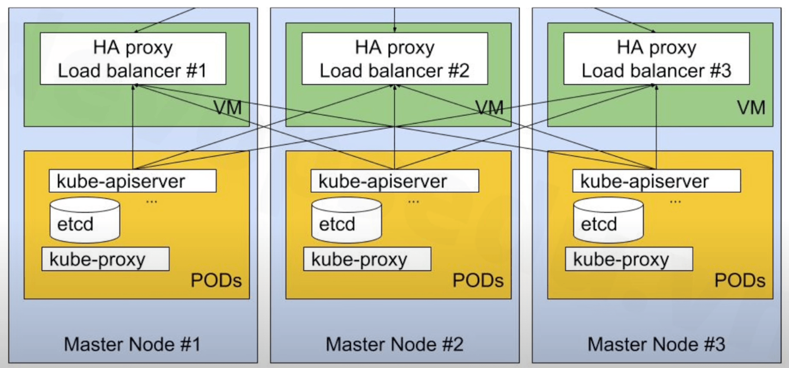

# k8s cluster installation

## Các cách cài đặt k8s cluster

Có trên dưới 40 cách cài Kubernetes cho hai môi trường `on-premise` và `cloud`, **_tuy nhiên cần lựa
chọn giải pháp cài đặt phù hợp môi trường và yêu cầu sử dụng_**. Dưới đây là các cách thực tế và thông
dụng nhất:

- Cài đặt thủ công:
  - `Kubeadm` cài đặt thủ công và rành mạch từng bước giúp `debug` dễ dàng khi có vấn đề hoặc lỗi,
  có thể cài đặt version mới nhất.

- Cài đặt tự động:
  - `kubespray`: tuy nhiên `kubespray` không đảm bảo cài đặt được `version` mới nhất.
  - `rke`
  - `kops`

## Cài đặt k8s cluster thủ công trên On-premise

> **Chú ý:** Không nên triển khai ứng dụng lên `server` đóng vai trò là `control plane`. Vì ứng dụng
> cao tải có thể chiếm tài nguyên của `control plan` làm ảnh hưởng đến cả quy trình điều phối của
> `control plane` và ảnh hưởng đến các dự án khác. Thông thường, **_cần một server riêng cho `control plane`_**.

Tuy nhiên, với các công ty start-up hoặc đối với những môi trường chưa quá quan trọng (dev hoặc staging, ...),
môi trường low-traffic hay chỉ để test những dự án nhỏ có thể triển khai `worker` và `master` lên
cùng một `server` để tận dụng tối đa tài nguyên.



- Dự án có thể được triển khai trên cả 3 server, giúp tận dụng tối đa tài nguyên.

### Cài đặt ban đầu cho k8s

Tạo `k8s cluster`:

1. Tạo `server` cho k8s:

    | Hostanme |  IP      | OS       | CPU (tối thiểu) | RAM (tối thiểu) |  Role        |
    |----------|----------------|------------|--------------|----------|------------------|
    | k8s-master-1 | 172.16.25.111 | Ubuntu 24.04   | 2            | 4      | Master/Node     |
    | k8s-master-2 | 172.16.25.112 | Ubuntu 24.04   | 2            | 4      | Master/Node     |
    | k8s-master-3 | 172.16.25.113 | Ubuntu 24.04   | 2            | 4      | Master/Node     |

2. `Add host` cho từng `server` trong `/etc/hosts`:

    ```ini
    192.168.1.111 k8s-master-1
    192.168.1.112 k8s-master-2
    192.168.1.113 k8s-master-3
    ```

3. Cập nhập và nâng cấp các `linux packages`:

    ```sh
    apt update -y && apt upgrade -y
    ```

4. Tạo `user: devops` và chuyển sang sử dụng `user: devops`. Vì trong thực tế không nên sử dụng
k8s cluster với `user: root`:

    ```sh
    adduser devops
    usermod -aG sudo devops
    su devops
    cd /home/devops
    ```

5. Tắt `swap` do k8s yêu cầu. Nếu không tắt `swap` thì không thể kết nối được tới `api` của `k8s cluster`:

    ```sh
    # First disable swap
    sudo swapoff -a
    # And then to disable swap on start up in /etc/fstab
    sudo sed -i '/swap.img/s/^/#/' /etc/fstab
    ```

6. Cấu hình và tải `module kernel`:

    ```sh
    # Use 'sudo' to run the 'tee' command with superuser privileges
    # 'tee' is used to write to a file and also output to stdout
    # '/etc/modules-load.d/containerd.conf' is the target configuration file
    # '<<EOF' is a here-document, allowing us to input multiple lines until 'EOF' is reached
    # The contents ('overlay' and 'br_netfilter') will be written to the file
    sudo tee /etc/modules-load.d/containerd.conf <<EOF
    overlay           # Kernel module for overlay filesystem, used for container layers
    br_netfilter      # Kernel module for bridge networking, used for container network isolation
    EOF

    # Load the 'overlay' kernel module immediately
    # 'modprobe' is used to add or remove modules from the Linux kernel
    # 'overlay' enables the overlay filesystem, which is crucial for container storage efficiency
    sudo modprobe overlay

    # Load the 'br_netfilter' kernel module immediately
    # 'br_netfilter' enables bridge network filtering, essential for container network security
    # This module allows iptables to work with bridged network traffic
    sudo modprobe br_netfilter
    ```

7. Cấu hình hệ thống mạng:

    ```sh
    sudo tee /etc/sysctl.d/kubernetes.conf <<EOF

    # Enable iptables filtering for IPv6 traffic on bridge interfaces
    # This ensures that bridged IPv6 traffic passes through ip6tables rules
    net.bridge.bridge-nf-call-ip6tables = 1

    # Enable iptables filtering for IPv4 traffic on bridge interfaces
    # This ensures that bridged IPv4 traffic passes through iptables rules
    net.bridge.bridge-nf-call-iptables = 1

    # Enable IP forwarding for IPv4
    # This allows the system to forward packets between network interfaces, essential for Kubernetes networking
    net.ipv4.ip_forward = 1
    EOF

    # Apply all sysctl configurations, including the newly created '/etc/sysctl.d/kubernetes.conf'
    # 'sysctl --system' reloads all configuration files in '/etc/sysctl.d/' and other system locations
    # This ensures the kernel parameters are updated immediately without rebooting
    sudo sysctl --system
    ```

8. Cài đặt `containerd`:

    ```sh
    sudo apt install -y curl gnupg2 software-properties-common apt-transport-https ca-certificates
    sudo curl -fsSL https://download.docker.com/linux/ubuntu/gpg | sudo gpg --dearmour -o /etc/apt/trusted.gpg.d/docker.gpg

    sudo add-apt-repository "deb [arch=arm64] https://download.docker.com/linux/ubuntu $(lsb_release -cs) stable"
    # or
    sudo add-apt-repository "deb [arch=amd64] https://download.docker.com/linux/ubuntu $(lsb_release -cs) stable"

    sudo apt update -y && sudo apt install -y containerd.io

    ```

9. Cấu hình và khởi động lại `containerd`:

    ```sh
    containerd config default | sudo tee /etc/containerd/config.toml >/dev/null 2>&1
    sudo sed -i 's/SystemdCgroup = false/SystemdCgroup = true/g' /etc/containerd/config.toml

    sudo systemctl restart containerd && sudo systemctl enable containerd
    ```

10. Cài đặt `kubernates`:

    ```sh
    echo "deb [signed-by=/etc/apt/keyrings/kubernetes-apt-keyring.gpg] https://pkgs.k8s.io/core:/stable:/v1.30/deb/ /" | sudo tee /etc/apt/sources.list.d/kubernetes.list
    curl -fsSL https://pkgs.k8s.io/core:/stable:/v1.30/deb/Release.key | sudo gpg --dearmor -o /etc/apt/keyrings/kubernetes-apt-keyring.gpg

    sudo apt update -y && sudo apt install -y kubelet kubeadm kubectl
    sudo apt-mark hold kubelet kubeadm kubectl

    ```

    > **Chú ý**: Nên `hold` lại `version` cho `kublet`, `kubeadm` và `kubectl` để đảm bảo `apt update && apt upgrade`
    > **_linux sẽ không cập nhập các packages lên version mới_** tránh xung đột `version` và khiến
    > cho `k8s cluster` bị lỗi.

### Cài đặt `k8s cluster` với `1 master 2 workers`

- Trên `server` đóng vai trò là `control plane`:

    ```sh
    # Initialize the Kubernetes cluster using kubeadm
    # This command sets up the Kubernetes control-plane node. It configures essential components like API server, controller manager, scheduler, etc
    sudo kubeadm init

    # Create the .kube directory in the home directory of the user if it doesn't already exist
    # This is where Kubernetes configuration files (like kubeconfig) will be stored for kubectl to use
    mkdir -p $HOME/.kube

    # Copy the admin kubeconfig file to the user's .kube directory
    # The kubeconfig file is required for kubectl to interact with the Kubernetes cluster. This command ensures that the admin configuration file is available for the user
    sudo cp -i /etc/kubernetes/admin.conf $HOME/.kube/config

    # Change the ownership of the kubeconfig file to the current user
    # This is necessary because by default, the kubeconfig file is owned by root. We want to allow the current user to access and modify it
    sudo chown $(id -u):$(id -g) $HOME/.kube/config

    # Apply the Calico manifest to set up networking in the Kubernetes cluster
    # This installs Calico, a popular networking solution for Kubernetes that provides networking, network security, and network policy enforcement
    kubectl apply -f https://raw.githubusercontent.com/projectcalico/calico/v3.25.0/manifests/calico.yaml

    ```

- Trên `server` đóng vai trò là `worker`:

    ```sh
    # Join a new node (worker node) to the existing Kubernetes cluster
    # This command is executed on a worker node to join it to the cluster controlled by the master node (API server at 192.168.1.111:6443)
    sudo kubeadm join 192.168.1.111:6443 --token <token> --discovery-token-ca-cert-hash <sha>
    ```

### Reset `k8s cluster`

- Chạy câu lệnh sau trên tất cả các `server` trong `k8s cluster`:

```sh
sudo kubeadm reset -f
sudo rm -rf /var/lib/etcd
sudo rm -rf /etc/kubernetes/manifests/
```

### Cài đặt `k8s cluster` với `3 masters workers`

- Thực hiện trên một `server` bất kỳ:

    ```sh
    # Initialize the Kubernetes cluster with the specified control plane endpoint
    # This sets up the control plane node and specifies the API server endpoint that other nodes will use to communicate with the control plane
    # `--control-plane-endpoint` allows you to define a fixed endpoint for the control plane, useful for HA (High Availability) setups where multiple control-plane nodes may exist
    # `--upload-certs` uploads the certificates used by the control plane to a secure location (typically the cloud or a shared resource), allowing other control plane nodes to join the cluster securely
    sudo kubeadm init --control-plane-endpoint "192.168.1.111:6443" --upload-certs

    # Create the .kube directory in the home directory of the user if it doesn't exist
    # This directory will store the kubeconfig file, which is needed for kubectl to interact with the Kubernetes cluster
    mkdir -p $HOME/.kube

    # Copy the admin kubeconfig file (which contains the connection information and credentials for the control plane)
    # This file is required for kubectl to communicate with the Kubernetes API server
    # The admin.conf file is created during `kubeadm init`
    sudo cp -i /etc/kubernetes/admin.conf $HOME/.kube/config

    # Change ownership of the kubeconfig file to the current user
    # By default, the admin.conf file is owned by root, so this command gives the current user ownership to allow access
    sudo chown $(id -u):$(id -g) $HOME/.kube/config

    # Apply the Calico manifest to set up networking for the Kubernetes cluster
    # Calico is a network plugin for Kubernetes that provides networking, network security, and policies
    # The `kubectl apply` command deploys the Calico components to the cluster
    kubectl apply -f https://raw.githubusercontent.com/projectcalico/calico/v3.25.0/manifests/calico.yaml
    ```

- Thực hiện trên các `servers` còn lại:

    ```sh
    # Join a new control plane node to the existing Kubernetes cluster
    # This command is executed on a new control plane node that you want to add to the cluster
    # 192.168.1.111:6443 - The API server of the control plane (master node) that this node will join
    # --token <token> - The token for authentication, generated during `kubeadm init`. It authenticates the joining node with the API server
    # --discovery-token-ca-cert-hash <sha> - The SHA-256 hash of the CA certificate used by the Kubernetes API server. This ensures that the worker node is connecting to the correct API server and prevents man-in-the-middle attacks
    # --control-plane - Indicates that this node will be part of the control plane (not just a worker node)
    # --certificate-key <key> - The certificate key used for securely sharing certificates among control plane nodes. It allows the new control plane node to access the existing cluster’s certificates
    sudo kubeadm join 192.168.1.111:6443 --token <token> --discovery-token-ca-cert-hash <sha> --control-plane --certificate-key <key>

    # Create the .kube directory in the user's home directory (if it doesn't already exist)
    # This directory is where Kubernetes configuration files (like kubeconfig) are stored for kubectl to use
    mkdir -p $HOME/.kube

    # Copy the admin kubeconfig file to the user's .kube directory
    # This file contains the connection details (such as the API server address, authentication credentials, etc.) for kubectl to interact with the cluster
    # The `admin.conf` file is created during the `kubeadm init` process on the control plane node
    sudo cp -i /etc/kubernetes/admin.conf $HOME/.kube/config

    # Change ownership of the kubeconfig file to the current user
    # This ensures that the current user has access to the kubeconfig file, as by default, it’s owned by root
    # This allows the user to run `kubectl` commands and interact with the Kubernetes cluster
    sudo chown $(id -u):$(id -g) $HOME/.kube/config
    ```

- Chỉ định các `servers` vừa là `master` vừa là `worker`:

    ```sh
    # Remove taint on the specific node, allowing pods to be scheduled on this node again
    kubectl taint nodes <node-name> node-role.kubernetes.io/control-plane:NoSchedule-
    ```

## Cài đặt k8s cluster tự động trên On-premise

1. Tương tự như bước 1 trong [Cài đặt ban đầu cho k8s](#cài-đặt-ban-đầu-cho-k8s).
2. Tương tự như bước 2 trong [Cài đặt ban đầu cho k8s](#cài-đặt-ban-đầu-cho-k8s).
3. Tương tự như bước 3 trong [Cài đặt ban đầu cho k8s](#cài-đặt-ban-đầu-cho-k8s).
4. Tương tự như bước 4 trong [Cài đặt ban đầu cho k8s](#cài-đặt-ban-đầu-cho-k8s).
5. Cài đặt `k8s cluster` sử dụng `Ansible` trên một `server` bất kỳ:

- Cài đặt `Ansible`:

    ```sh
    apt install git python3 python3-pip -y
    apt install ansible-core -y
    ```

- Thiết lập `SSH login` không cần dùng `password`:

    ```sh
    # Generate a new SSH key pair using RSA encryption algorith
    ssh-keygen -t rsa

    # Copy the public SSH key to the remote server at 192.168.1.111,
    # allowing you to authenticate using the SSH key instead of a password
    # ssh-copy-id will ask you promting the password, Appends your public key (~/.ssh/id_rsa.pub)
    # to the remote server's ~/.ssh/authorized_keys file
    $ ssh-copy-id devops@192.168.1.111
    $ ssh-copy-id devops@192.168.1.112
    $ ssh-copy-id devops@192.168.1.113
    ```

- Thiết lập cho `Ansible`:

    ```sh
    git clone https://github.com/kubernetes-incubator/kubespray.git --branch release-2.24
    cd kubespray/

    # Copy files and directories recursively, forcing overwrites of existing files,
    # and preserving file attributes like permissions, ownership, and timestamps
    cp -rfp inventory/sample inventory/k8s-cluster

    vi inventory/k8s-cluster/hosts.ini
    ```

    ```ini
    [all]
    k8s-master-1  ansible_host=192.168.1.111      ip=192.168.1.111
    k8s-master-2  ansible_host=192.168.1.112      ip=192.168.1.112
    k8s-master-3  ansible_host=192.168.1.113      ip=192.168.1.113

    [kube-master]
    k8s-master-1
    k8s-master-2
    k8s-master-3

    [kube-node]
    k8s-master-1
    k8s-master-2
    k8s-master-3

    [etcd]
    k8s-master-1

    [k8s-cluster:children]
    kube-node
    kube-master

    [calico-rr]

    [vault]
    k8s-master-1
    k8s-master-2
    k8s-master-3
    ```

- Tiến hành cài đặt `k8s cluster`:

    ```sh
    ansible-playbook -i inventory/beeshoes-cluster/hosts.ini  --become --become-user=root cluster.yml
    ```

## Cài đặt k8s cluster trên Cloud

Xem video và hướng dẫn ở [đây](https://devopsedu.vn/courses/khoa-hoc-kubenetes-thuc-te/lesson/bai-6-trien-khai-kubernetes-cluster-tren-cloud-gke-2/)

Cần làm gì khi không sử dụng `k8s cluster` trên `cloud`:

1. Scale về 0: không phải trả chi phí cho các VM instances, chỉ tốn tiền cho master node (nếu không dùng GKE Autopilot), vẫn có thể duy trì trạng thái cluster và nhanh chóng khôi phục hoạt động. Tuy nhiên, quản lý phức tạp hơn và vẫn có tính các chi phí khác như IP (Nếu dùng static), hay Disk,...
2. Xóa Cluster: đúng là không tốn thêm tiền. Tuy nhiên, mất thời gian khôi phục và đã xóa rồi thì các tài nguyên sẽ mất hết lần sau lab sẽ tốn thời gian nếu trong tần suất lab hàng ngày thì option này chưa tốt.
3. Snapshot cluster và export tài nguyên: cách này thì đầu tiên em backup toàn bộ tài nguyên trong cluster (manifest),  tạo snapshot cho persistent disks,  và cũng vẫn xóa cluster hoàn toàn lần sau tạo lại thì dùng backup sẽ nhanh hơn và tiết kiệm chi phí hơn. Tuy nhiên là chắc chắn rồi mất thời gian hơn cách scale về 0 một chút.

> Tóm lại là scale node pool về 0, dùng cho trường hợp cần tạm ngừng nhưng sớm sử dụng lại. Xoá cluster, dùng khi không cần trong thời gian dài, snapshot & export resources là phương án cân bằng, linh hoạt, tiết kiệm tối đa chi phí nhưng vẫn giữ khả năng khôi phục em có thể cân nhắc áp dụng nhé.
